# Sistema de Gestão de Manutenção (SGM) - Formativa

## Briefing
O projeto consiste no desenvolvimento de um Sistema de Gestão de Manutenção (SGM) no formato de uma aplicação web. O objetivo é centralizar e otimizar o controle das atividades de manutenção de máquinas e equipamentos de uma empresa. A plataforma permitirá o cadastro de equipamentos, agendamento de manutenções preventivas e corretivas, e o gerenciamento de ordens de serviço.

## Objetivo do Projeto
- gerenciar informações sobre equipamentos e manutenção realizadas pela empresa
- realizar abertura de chamados de manutenção (ordens de serviço)
- dashboard de históricos de manutenção
- proteger acesso aos dados do sistema (criptografia e autenticação segura de usuários)

## Público-Alvo
- Tecnicos de Manutenção (usuários finais)
- Gestores de Manutenção (usuáriso intermediários)
- Administradores do Sistema (Gerenciar a permissão dos usuários)

## Levantamento de Requistos do Projeto

- ### Requistos Funcionais

- ### Requisitos Não Funcionais

## Recursos do Projeto
- ### Tecnológicos
    - Framework de Desenvolvimento Next/React
    - Linguagem de Programação: TypeScript
    - Banco de Dados: Não Relacional (MongoDB)
    - GitHub
    - VsCode
    - Figma

- ### Pessoal
    - Dev Tudo

## Análise de Risco

## Diagramas

1. ### Classe
Descrever o Comportamento das Entidades de um Projeto

- Usuário (User/Usuario)
    - Atributos: id, nome, email, senha, função
    - métodos: create, read, update, delete, login, logout

- Equipamento (Equipment/Equipamento)
    - Atributos: id, modelo, marca, localiza, status, numeroSerie
    - Métodos: CRUD

- Ordem de Serviço (OrdemServico)
    - Atributos:  id, titulo, descricao, tipoManutenção, status, idTecnico, IdEquipamento

```mermaid

classDiagram

    class Usuario{
        +String id
        +String nome
        +String email
        +String senha
        +Enun funcao
        +login()
        +logout()
        +CRUD()
    }

    class Equipamento{
        +String id
        +String modelo
        +String marca
        +String localizacao
        +boolean status
        +String numSerie
        +CRUD()
    }

    class OrdemServico{
        +String id
        +String titulo
        +String descricao
        +String tipoManutencao
        +Enum status
        +String idTecnico
        +String IdEquipamento
        +CRUD()
    }

    Usuario "1"--"1+" OrdemServico: "é Responsável por"
    Equipamento "1"--"1+" OrdemServico: "associada a"

```

2. ### Caso de Uso
Ilustra as interações dos diferentes tipos de usuários (Atores) com as funcionalidade do sistema

- Caso de Uso:
    - Técnico: Gerenciar Ordens de Serviço (CRUD) e acessar o Dashboard;
    - Gerente: funções do técnico + Gerenciamento de Equipamentos (CRUD);
    - Admin: Gerenciar Usuários do Sistema, acessar o Dashboard

    Fazer o login -> Antes de Qualquer Ação

```mermaid

graph TD

    subgraph "SGM"
        caso1([Fazer Login])
        caso2([Gerenciar Ordens de Srviço - CRUD])
        caso3([Gerenciar Equipamentos - CRUD])
        caso4([Gerenciar Usuários])
        caso5([Acessar o DashBoard])
    end

    Tecnico([👩‍🔧Técnico de Manutenção])
    Gerente([👩‍💼Gerente de Manutenção])
    Admin([Administrador do Sistema])

    Tecnico --> caso1
    Tecnico --> caso3
    Tecnico --> caso5

    Gerente --> caso1
    Gerente --> caso2
    Gerente --> caso3
    Gerente --> caso5

    Admin --> caso1
    Admin --> caso4
    Admin --> caso5

    caso1 -.-> caso2
    caso1 -.-> caso3
    caso1 -.-> caso4
    caso1 -.-> caso5
    
```

3. ### Fluxo
Detalha o passo a passo para realizar uma ação no sistema

- Diagrama de fluxo de Login
    - O usuário acessa a tela de login
    - Insere as credenciais
    - O sistema verifica as Credenciais
        - se sim: ger um JWT (Token) => Dashboard
        - se não: manda uma mensagem de erro - Permanece na tela de Login

```mermaid

graph TD
    A[Início] --> B{Acessa a Tela de Login}
    B --> C[Preencher Email e Senha]
    C --> D{Validar as Credenciais}
    D --> SIM --> E[Gerar um Token JWT]
    E --> F[DashBoard]
    D --> NÃO --> G[Mensagem de Erro]
    G --> B

```

