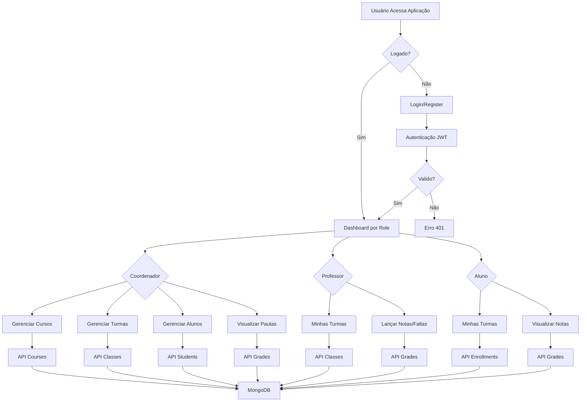

# Sistema de Gestão Acadêmica - Polyglot

## Visão Geral do Projeto

Este é um sistema MVP (Minimum Viable Product) para gestão acadêmica da escola de idiomas Polyglot. O sistema permite gerenciar cursos, turmas, alunos, matrículas, notas e faltas, com diferentes níveis de acesso baseados em roles (coordenador, professor, aluno).

### Funcionalidades Principais
- **Autenticação e Autorização**: Login/registro com JWT e controle de acesso por roles
- **Gerenciamento de Cursos**: CRUD completo para cursos oferecidos
- **Gerenciamento de Turmas**: Criação de turmas vinculadas a cursos e professores
- **Gerenciamento de Alunos**: Cadastro e administração de alunos
- **Matrículas**: Controle de matrículas de alunos em turmas
- **Notas e Faltas**: Lançamento e visualização de notas e controle de presença
- **Dashboards**: Interfaces diferenciadas por tipo de usuário

## Tecnologias Utilizadas

### Backend
- **Next.js 16**: Framework React para aplicações web full-stack
- **TypeScript**: Superset JavaScript com tipagem estática
- **MongoDB**: Banco de dados NoSQL
- **Mongoose**: ODM para MongoDB
- **JWT (jsonwebtoken)**: Autenticação baseada em tokens
- **bcryptjs**: Hashing de senhas

### Frontend
- **React 19**: Biblioteca para construção de interfaces
- **Tailwind CSS**: Framework CSS utilitário
- **SCSS**: Pré-processador CSS

### Ferramentas de Desenvolvimento
- **ESLint**: Linting de código
- **TypeScript**: Compilador TypeScript
- **Next.js CLI**: Ferramentas de desenvolvimento

## Arquitetura

### Diagrama de Fluxo do Sistema



### Diagrama de Classes

```mermaid
classDiagram
    class User {
        +String email
        +String password
        +String role
        +String name
        +Date createdAt
        +Date updatedAt
        +comparePassword()
    }

    class Course {
        +String name
        +String description
        +Date createdAt
        +Date updatedAt
    }

    class Class {
        +String name
        +ObjectId courseId
        +ObjectId teacherId
        +Date createdAt
        +Date updatedAt
    }

    class Student {
        +String name
        +String email
        +Date createdAt
        +Date updatedAt
    }

    class Enrollment {
        +ObjectId studentId
        +ObjectId classId
        +Date createdAt
        +Date updatedAt
    }

    class Grade {
        +ObjectId studentId
        +ObjectId classId
        +Number grade
        +Boolean absence
        +Date date
        +Date createdAt
        +Date updatedAt
    }

    User ||--o{ Class : teaches
    Course ||--o{ Class : contains
    Student ||--o{ Enrollment : enrolls
    Class ||--o{ Enrollment : has
    Student ||--o{ Grade : receives
    Class ||--o{ Grade : assigns
```

## Guia Passo a Passo do Projeto

### Pré-requisitos
- Node.js (versão 18 ou superior)
- MongoDB (local ou Atlas)
- npm ou yarn

### 1. Clonagem e Instalação
```bash
# Clone o repositório
git clone <url-do-repositorio>
cd gestao-academica

# Instale as dependências
npm install
```

### 2. Configuração do Banco de Dados
```bash
# Crie um arquivo .env.local na raiz do projeto
touch .env.local
```

Adicione as seguintes variáveis ao `.env.local`:
```
MONGODB_URI=mongodb://localhost:27017/polyglot-academic
JWT_SECRET=sua-chave-secreta-jwt-muito-segura
```

**Nota**: Substitua `mongodb://localhost:27017/polyglot-academic` pela URI do seu MongoDB se estiver usando MongoDB Atlas ou uma configuração diferente.

### 3. Inicialização do Servidor de Desenvolvimento
```bash
# Execute o servidor de desenvolvimento
npm run dev
```

Abra [http://localhost:3000](http://localhost:3000) no navegador para acessar a aplicação.

### 4. Estrutura do Projeto
```
gestao-academica/
├── app/                    # Páginas Next.js (App Router)
│   ├── api/               # APIs RESTful
│   │   ├── auth/          # Autenticação
│   │   ├── courses/       # Cursos
│   │   ├── classes/       # Turmas
│   │   ├── students/      # Alunos
│   │   ├── enrollments/   # Matrículas
│   │   └── grades/        # Notas
│   ├── login/             # Página de login
│   ├── register/          # Página de registro
│   ├── dashboard/         # Dashboard principal
│   └── ...
├── lib/                   # Utilitários
│   ├── auth.ts           # Funções de autenticação
│   ├── middleware.ts     # Middleware de autorização
│   └── mongodb.ts        # Conexão MongoDB
├── models/               # Modelos Mongoose
│   ├── User.ts
│   ├── Course.ts
│   ├── Class.ts
│   ├── Student.ts
│   ├── Enrollment.ts
│   └── Grade.ts
├── public/               # Assets estáticos
└── ...
```

### 5. Funcionalidades Implementadas

#### Autenticação
- Registro de usuários com roles (coordenador, professor, aluno)
- Login com geração de JWT
- Middleware para proteção de rotas

#### APIs RESTful
- **Auth**: `/api/auth/login`, `/api/auth/register`
- **Courses**: `/api/courses`, `/api/courses/[id]`
- **Classes**: `/api/classes`, `/api/classes/[id]`
- **Students**: `/api/students`, `/api/students/[id]`
- **Enrollments**: `/api/enrollments`, `/api/enrollments/[id]`
- **Grades**: `/api/grades`, `/api/grades/[id]`

#### Frontend
- Páginas responsivas com Tailwind CSS
- Dashboards diferenciados por role
- Formulários para CRUD operations
- Navegação protegida

### 6. Testes e Desenvolvimento
```bash
# Execute o linter
npm run lint

# Build para produção
npm run build

# Execute em modo produção
npm start
```

### 7. Próximos Passos (TODO)
- Implementar autenticação completa no frontend
- Migrar estilização para SCSS com arquitetura organizada
- Criar componentes reutilizáveis
- Implementar cálculo automático de médias
- Adicionar validações mais robustas
- Implementar testes unitários e de integração

## Contribuição
1. Faça um fork do projeto
2. Crie uma branch para sua feature (`git checkout -b feature/nova-funcionalidade`)
3. Commit suas mudanças (`git commit -am 'Adiciona nova funcionalidade'`)
4. Push para a branch (`git push origin feature/nova-funcionalidade`)
5. Abra um Pull Request


